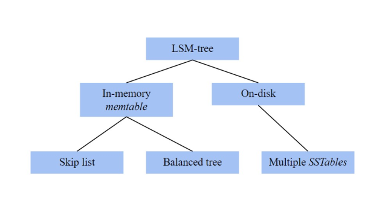

# 1. Introduction and General Overview

[Take Me Home](README.md)
 

## Introduction

Databases need data structures to store data and implement access methods for efficient access of
a data item.

Traditionally, B+-trees are used for this data structure for its efficient handling of read and
write operations. However, log-structured merge trees are recently a widely adopted alternative
due to its efficiency in handling write-intensive workloads.

### B+-trees

- Traditional approach.
- Built for when read and write operations are more balanced.

### Log-structured merge trees (LSM-trees)

- Newer approach.
- Built for write-intensive workloads.
- Widely adopted by newer database systems.

 

## General Overview

    <h3>What Makes an LSM-tree?</h3>
    

 

An LSM-tree consists of an in-memory memtable that can either use a skip list or balanced tree as
its data structure.

It also has on-disk storage that uses multiple SSTables to store data on-disk.

[Next: Main Components of an LSM-tree](02_main_components.md)

 
