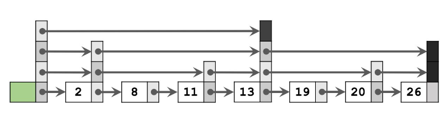
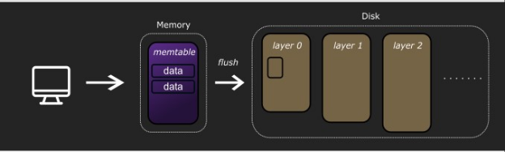

# 2. Main Components of an LSM-tree

[Take Me Home](README.md)
 

## Memory Component

- All incoming writes are appended to the memory component, which is also known as the memtable.
  Treating the memtable as a log is what makes handling write throughput so efficient.

- Memtables implement a data structure to store data. This simulation uses a skip list to store
  the memtable's data.

- A skip list is a multi-layered linked list data structure. The base level has
  all the nodes, but searches start at the top layer with the least amount of nodes, skipping
  over elements for a fast search.

    <h3>Skip list Diagram</h3>
    
     
    The diagram above models a skip list.

 

- When the memtable gets full, the data is flushed as a Sorted String Table (SSTable),
  which is stored in the first layer of the disk section.

 

## Disk Component

- Data is stored persistently on disk.

- The disk component consists of several levels or segments that contain several of some chosen
  data structure, with the next layer holding even more of the chosen data structure.

- It’s common for the layers of the disk component to hold Sorted String Tables (SSTables).

- An SSTable is a disk-based data structure with sorted key-value pairs. It’s designed for
  optimizations to be implemented.

- The layers of the disk component represent the layers of a tree.

 

    <h3>LSM-tree Diagram</h3>
    

 
The diagram above models the main components of an LSM-tree.

[Next: Main Optimizations for an LSM-tree](03_optimizations.md)

 
