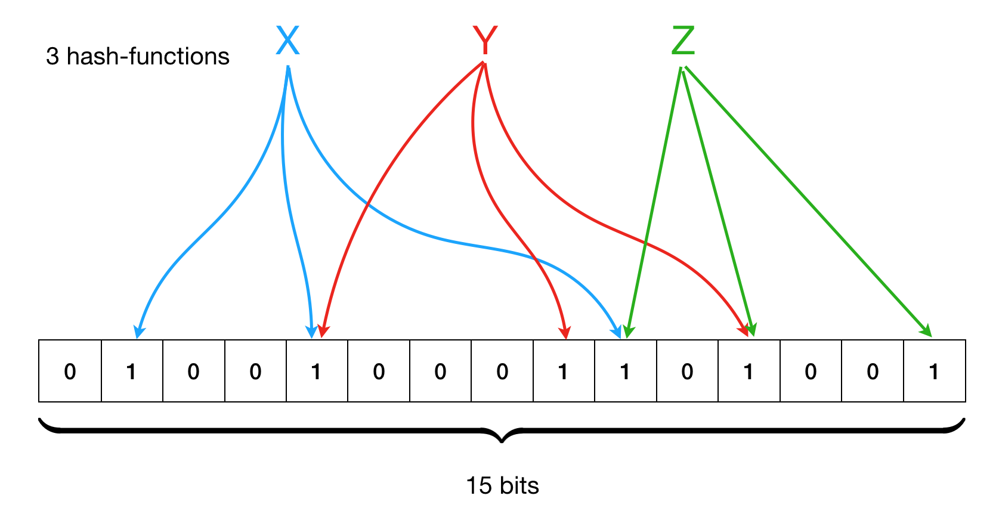

# 3. Main Optimizations for an LSM-tree

[Take Me Home](README.md)
 

## Compaction

- With compaction, storage and read performance are improved by merging smaller SSTables and
  eliminating obsolete data.

- Compaction policies, such as leveling and tiering, are arguably the most important optimization
  for LSM-trees.

  - Leveling: When a level/layer gets full, smaller SSTables are merged into a larger one on
    the next level.

  - Tiering: Data is separated into tiers based on size, age, or access frequency.
    Custom compaction policies for each tier help optimize compaction.

 

## Bloom Filters

- Bloom filters improve read performance by reducing unnecessary access to places in storage
  that don’t have the desired key.

- When data is written to a data structure with a Bloom filter, the data is hashed three times to
  become a random index of a bit array. The three indexes in the bit array are turned into a 1.

 

    
     
    Diagram to show how a Bloom filter uses hash functions to map to indexes of a bit array.

 

- When looking up data, it’s ran through the hashes again, and if any of the indexes map to a 0,
  the data is not contained in the data structure. If every index maps to a 1, the data may be in
  the data structure.

- False positives occur when every index maps to a 1, but the data is not in the data structure.
  This gives reads an average time complexity of constant time, but a worst-case scenario time
  complexity of O(n).

- In LSM-trees, Bloom filters are commonly applied to SSTables, but can also be applied to the
  layers that hold SSTables.

 

## Tombstones

- Tombstoning is considered a fundamental optimization for LSM-trees.

- LSM-trees are designed for fast write operations, so instead of spending the time of directly
  deleting data when a delete instruction occurs, it's faster to write new data.

- Tombstoning refers to the process of marking a data entry as deleted, rather than physically
  removing it from the data structure immediately.

- The entry that marks the data as deleted is referred to as a tombstone.

## Other Optimizations?

It’s important to note that there are more ways to optimize LSM-trees.

Here are some examples:

- Partitioning

  - Distribute data across multiple storage devices or nodes.
  - Can improve parallelism for read and write operations.
  - Each partition operates independently, which can enhance overall system throughput.

- Multi-threaded Compaction

  - LSM-trees with lots of data could use multi-threaded compaction.
  - Parallelize the merging of SSTables so compaction is more efficient.

- Fine-tune Bloom Filter Performance

  - Minimize false positives by finding the right hashes, bit array size, etc.

- Write-ahead Log

  - To prevent data loss in the event of failure, LSM-trees can implement a
    write-ahead logging mechanism.
  - Data changes are first written to a log on disk before being committed to the memtable.

 

**How LSM-trees are implemented and what optimizations they choose to implement depends**
**on the use case of the LSM-tree.**

[Next: How to Use the Application](04_application_guide.md)
