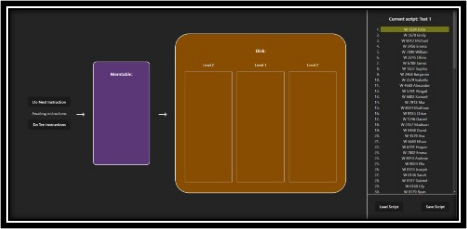

# 4. How to Use the Application
[Take Me Home](README.md)

 

    </img>

 

This application is a simulation/visual representation of the main components of an LSM-tree and how it behaves. This application is divided into three panels.

## Top Right Panel

- Displays the selected script and a list of the instructions inside of the script.

- Highlighted in yellow is the next instruction that will be executed if the “Do Next Instruction” button is pressed.

## Bottom Right Panel

- The “Load Script” button displays a popup window that allows the user to select any script of instructions currently in the database.

- The “Save Script” button displays a popup window that allows the user to enter the name and instructions of a script to save to the database.

## Left Panel
- Displays the LSM-tree with all its components. 

- The “Do Next Instruction” button will execute the instruction highlighted in yellow.

- The “Do Ten Instruction" button will execute the next ten instructions for convenience.

- Between these two buttons is a message that will update the user on the result of the executed instruction.

- Memtable uses a skip list data structure to store data.

- The disk holds 3 layers. Layer 0 and Layer 1 can hold a maximum of two SSTables. Layer 2 can hold any amount of SSTables.

- When a read is performed, any SSTables that performed a lookup with their Bloom filter will display the result of the Bloom filter lookup.

    - If a 1 is displayed above an SSTable, then the Bloom filter reported that the data may be contained, and a binary search occurred.

    - If a 0 is displayed above an SSTable, then the Bloom filter reported that the data is not contained, and a binary search was not performed.

- When a read occurs and the result is found, the result will be highlighted where it was found.

 